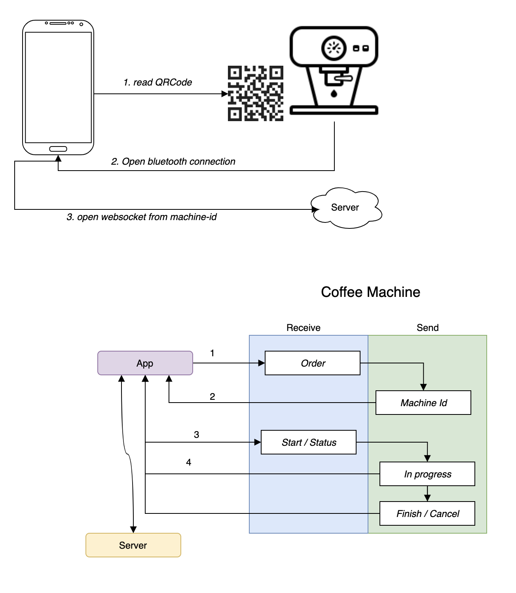

# Dojo - Coroutines Channels 2
## Desafio
Para este dojo, nosso desafio é montar um sistema para compra em uma maquina de café.
1. Por meio do app, o usuário lê um QR Code para iniciar a compra;
2. Uma conexão bluetooth é iniciada entre o app e a máquina;
3. Após a conexão ser estabelecida entre o app e a máquina, uma conexão de websocket é
aberta entre o app e o server;
4. Toda mensagem que é recebida da máquina é repassada para o server até que a operação
seja finalizada ou cancelada.
   
Com base nesse cenário, devemos utilizar Channels para criar as comunicações entre o app,
a máquina e o server.

