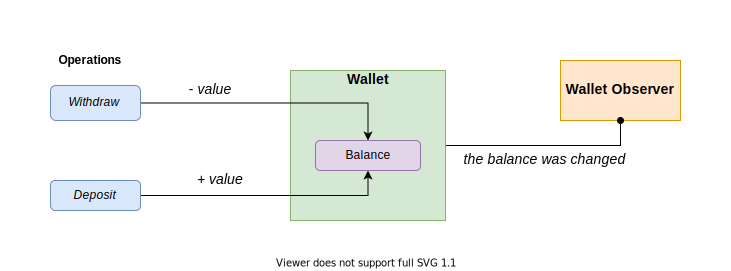

# Kotlin Channels Challenge
## Desafio
Precisamos construir uma `Wallet` que deverá suportar duas operações:
- `Depósito`, incrementa o valor do saldo da `Wallet`
- `Saque`, decrementa o valor do saldo da `Wallet`

### Parte I
Toda a movimentação que acontece na `Wallet` deverá notificar um observador, o `Wallet Observer`.

### Parte II
A `Wallet` deverá garantir a integridade das operações para que quando solicitado o valor atual do `Saldo`, o mesmo sempre estará atualizado.

### Bônus
A `Wallet` deverá permitir múltiplos observadores.

